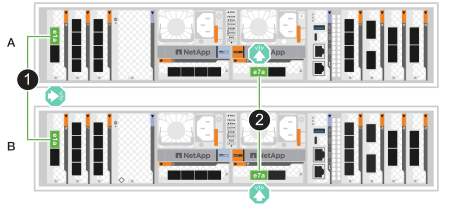
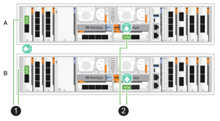
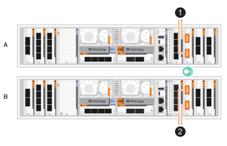
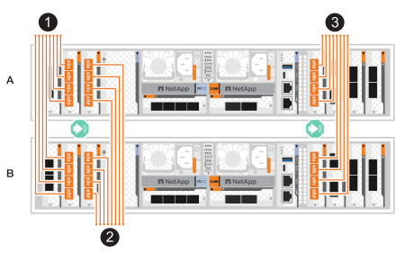
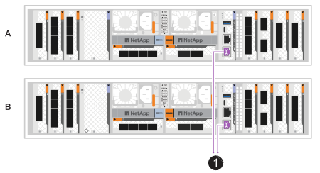
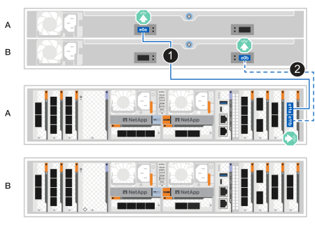
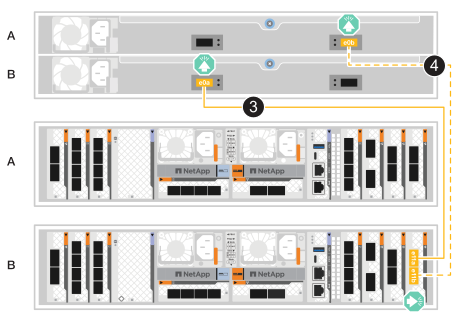
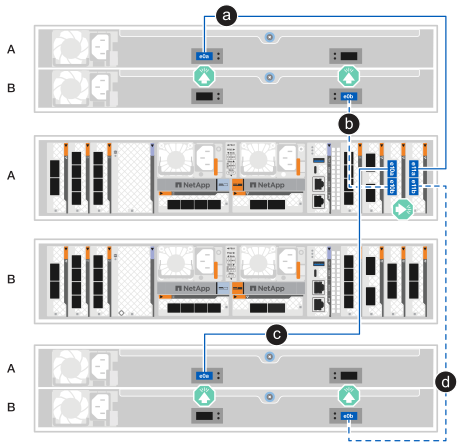
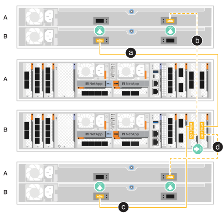

= ASA A1Kストレージシステムのハードウェアをケーブル接続します
:allow-uri-read: 
:icons: font
:imagesdir: ../media/

[role="lead"]
ASA A1Kストレージシステムをネットワークとストレージシェルフに接続して、クラスタ通信、管理アクセス、およびSANホスト接続を有効にします。この手順には、クラスタ/HAインターコネクト、管理ネットワーク、ホストネットワーク、およびストレージシェルフ接続のケーブル配線が含まれます。

.開始する前に
ストレージシステムをネットワークスイッチに接続する方法については、ネットワーク管理者にお問い合わせください。

.タスクの内容
* ここでは、一般的な設定について説明します。具体的なケーブル接続は、ご使用のストレージシステム用に注文したコンポーネントによって異なります。設定およびスロットプライオリティの詳細については、を参照してください link:https://hwu.netapp.com["NetApp Hardware Universe"^]。
* ASA A1KのI/Oスロットには、1から11までの番号が付けられています。
+
image::../media/drw_a1K_back_slots_labeled_ieops-2162.svg[ASA A1Kコントローラーのスロット番号]

* ケーブル配線図には、ポートにコネクタを挿入する際のケーブルコネクタプルタブの正しい方向（上または下）を示す矢印アイコンがあります。
+
コネクタを挿入すると、カチッという音がしてコネクタが所定の位置に収まるはずです。カチッと音がしない場合は、コネクタを取り外し、裏返してもう一度試してください。

+
image:../media/drw_cable_pull_tab_direction_ieops-1699.svg["ケーブルプルタブの方向"]

* 光スイッチにケーブル接続する場合は、光トランシーバをコントローラポートに挿入してから、スイッチポートにケーブル接続します。

[[step-1-cable-the-clusterha-connections]]
== 手順1：クラスタ/ HAをケーブル接続する

コントローラーをケーブルで接続してONTAPクラスター接続を作成します。スイッチレスクラスタの場合は、コントローラ同士を接続します。スイッチドクラスタの場合は、コントローラをクラスタネットワークスイッチに接続します。

NOTE: クラスタインターコネクトトラフィックとHAトラフィックは、同じ物理ポートを共有します。

[role="tabbed-block"]
====
.スイッチレスクラスタのケーブル接続
--
クラスタ ネットワーク スイッチを使用せずに、2つのコントローラを直接接続する場合は、このケーブル接続オプションを使用してください。

クラスタ/ HAインターコネクトケーブルを使用して、ポートe1aとe1a、ポートe7aとe7aを接続します。

.手順
. コントローラAのポートe1aをコントローラBのポートe1aに接続します。
. コントローラAのポートe7aをコントローラBのポートe7aに接続します。
+
*クラスタ/ HAインターコネクトケーブル*

+

+

--
.スイッチクラスタのケーブル接続
--
コントローラ同士を直接接続するのではなく、クラスタネットワークスイッチに接続する場合は、このケーブル接続オプションを使用してください。

100 GbE ケーブルを使用して、ポート e1a と e7a をクラスタネットワークスイッチに接続します。

NOTE: スイッチドクラスタ構成は ONTAP 9.16.1 以降でサポートされています。

.手順
. コントローラAのポートe1aとコントローラBのポートe1aをクラスタネットワークスイッチAに接続します。
. コントローラAのポートe7aとコントローラBのポートe7aをクラスタネットワークスイッチBに接続します。
+
* 100GbEケーブル*

+
image::../media/oie_cable100_gbe_qsfp28.png[100 GbE ケーブル]

+

--
====

[[step-2-cable-the-host-network-connections]]
== 手順2：ホストネットワーク接続をケーブル接続する

イーサネットモジュールポートをホストネットワークに接続します。

以下に、ホストネットワークのケーブル配線に関する一般的な例をいくつか示します。link:https://hwu.netapp.com["NetApp Hardware Universe"^]でお客様のシステム構成を参照してください。

[role="tabbed-block"]
====
.100 GbEホストネットワーク
--
ポートe9aとe9bを100 GbEイーサネットデータネットワーク スイッチに接続します。

NOTE: クラスタおよびHAトラフィックのシステムパフォーマンスを最大限に高めるには、ホストネットワーク接続にポートe1bおよびe7bを使用しないでください。パフォーマンスを最大限に引き出すには、別のホストカードを使用してください。

.手順
. コントローラAのポートe9aとコントローラBのポートe9aをイーサネットデータネットワーク スイッチに接続します。
. コントローラAのポートe9bとコントローラBのポートe9bをイーサネット データ ネットワーク スイッチに接続します。
+
* 100GbEケーブル*

+

+

--
.10/25 GbE ホスト ネットワーク
--
各コントローラの10/25 GbE I/Oモジュールポートをホストネットワーク スイッチに接続します。

*10/25 GbE ケーブル*

--
====

[[step-3-cable-the-management-network-connections]]
== 手順3：管理ネットワークをケーブル接続する

コントローラを管理ネットワークに接続します。

1000BASE-T RJ-45ケーブルを使用して、各コントローラの管理（レンチ）ポートを管理ネットワークスイッチに接続します。

.手順
. コントローラAの管理（レンチ）ポートを管理ネットワーク スイッチに接続します。
. コントローラBの管理（レンチ）ポートを管理ネットワーク スイッチに接続します。
+
* 1000BASE-T RJ-45ケーブル*

+

+

IMPORTANT: まだ電源コードを接続しないでください。

[[step-4-cable-the-shelf-connections]]
== 手順4：シェルフをケーブル接続する

ASA A1Kストレージシステムは、NSM100またはNSM100Bモジュールのいずれかを使用したNS224シェルフに対応しています。各モジュールの主な違いは以下のとおりです：

* NSM100 シェルフ モジュールは、組み込みポート e0a および e0b を使用します。
* NSM100B シェルフ モジュールは、スロット 1 のポート e1a と e1b を使用します。

以下の配線例は、シェルフモジュールポートを参照する際のNS224シェルフ内のNSM100モジュールを示しています。

ストレージシステムでサポートされるシェルフの最大数、および光ファイバやスイッチ接続などのすべてのケーブル接続オプションについては、を参照してくださいlink:https://hwu.netapp.com["NetApp Hardware Universe"^]。

[role="tabbed-block"]
====
.NS224ストレージシェルフ1台
--
NS224シェルフが1台の場合は、このケーブル接続オプションを使用します。

各コントローラをNS224シェルフのNSMモジュールに接続します。図は、各コントローラからのケーブル接続を示しています。コントローラAのケーブル接続は青、コントローラBのケーブル接続は黄色です。

.手順
. コントローラAで、次のポートを接続します。
+
.. ポートe11aをNSM Aのポートe0aに接続します。
.. ポートe11bをNSM Bのポートe0bに接続します。
+

. コントローラBで、次のポートを接続します。
+
.. ポートe11aをNSM Bのポートe0aに接続します。
.. ポートe11bをNSM Aのポートe0bに接続します。
+

--
.NS224ストレージシェルフ2台
--
NS224シェルフが2台ある場合は、このケーブル接続オプションを使用します。

各コントローラを両方のNS224シェルフのNSMモジュールに接続します。図は、各コントローラからのケーブル接続を示しています。コントローラAのケーブル接続は青、コントローラBのケーブル接続は黄色です。

.手順
. コントローラAで、次のポートを接続します。
+
.. ポートe11aをシェルフ1のNSM Aのポートe0aに接続します。
.. ポートe10bをシェルフ1のNSM Bポートe0bに接続します。
.. ポートe10aをシェルフ2のNSM Aのポートe0aに接続します。
.. ポートe11bをシェルフ2のNSM Bのポートe0bに接続します。
+

. コントローラBで、次のポートを接続します。
+
.. ポートe11aをシェルフ1のNSM Bのポートe0aに接続します。
.. ポートe10bをシェルフ1のNSM Aのポートe0bに接続します。
.. ポートe10aをシェルフ2のNSM Bのポートe0aに接続します。
.. ポートe11bをシェルフ2のNSM Aのポートe0bに接続します。
+

--
====
.次の手順
ストレージコントローラをネットワークに接続し、コントローラをストレージシェルフに接続したら、次の作業を行いlink:power-on-hardware.html["ASA R2ストレージシステムの電源をオンにします。"]ます。
