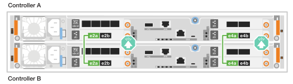
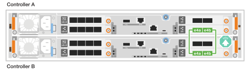
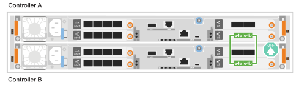
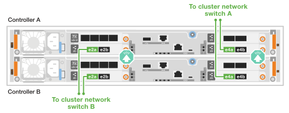
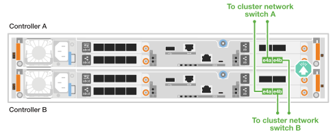
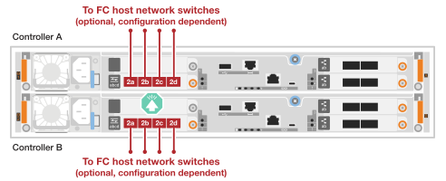
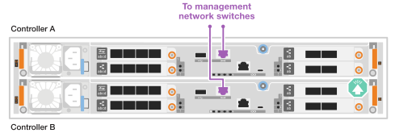
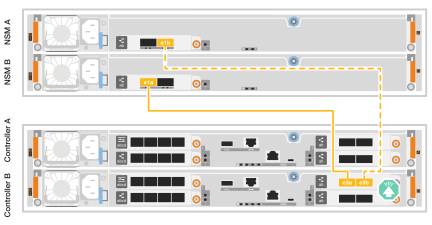

= ASA A20、ASA A30、ASA A50ストレージシステムのハードウェアをケーブル接続します
:allow-uri-read: 
:icons: font
:imagesdir: ../media/

[role="lead"]
ASA A20、ASA A30、またはASA A50ストレージシステムをネットワークとストレージシェルフに接続して、クラスタ通信、管理アクセス、およびSANホスト接続を有効にします。この手順には、クラスタ/HAインターコネクト、管理ネットワーク、ホストネットワーク、およびストレージシェルフ接続のケーブル配線が含まれます。

.開始する前に
ストレージシステムをネットワークスイッチに接続する方法については、ネットワーク管理者にお問い合わせください。

.タスクの内容
* ここでは、一般的な設定について説明します。具体的なケーブル接続は、ご使用のストレージシステム用に注文したコンポーネントによって異なります。設定およびスロットプライオリティの詳細については、を参照してください link:https://hwu.netapp.com["NetApp Hardware Universe"^]。
* ケーブル配線図には、ポートにコネクタを挿入する際のケーブルコネクタプルタブの正しい方向（上または下）を示す矢印アイコンがあります。
+
コネクタを挿入すると、カチッという音がしてコネクタが所定の位置に収まるはずです。カチッと音がしない場合は、コネクタを取り外し、裏返してもう一度試してください。

+
image:../media/drw_cable_pull_tab_direction_ieops-1699.svg["ケーブルプルタブの方向"]

* 光スイッチにケーブル接続する場合は、光トランシーバをコントローラポートに挿入してから、スイッチポートにケーブル接続します。

[[step-1-cable-the-clusterha-connections]]
== 手順1：クラスタ/ HAをケーブル接続する

コントローラーをケーブルで接続してONTAPクラスター接続を作成します。スイッチレスクラスタの場合は、コントローラ同士を接続します。スイッチドクラスタの場合は、コントローラをクラスタネットワークスイッチに接続します。

NOTE: クラスタインターコネクトトラフィックとHAトラフィックは、同じ物理ポートを共有します。

[role="tabbed-block"]
====
.スイッチレスクラスタのケーブル接続
--
クラスタ ネットワーク スイッチを使用せずに、2つのコントローラを直接接続する場合は、このケーブル接続オプションを使用してください。

.2ポートの40 / 100GbE I/Oモジュールを2つ搭載したASA A30またはASA A50
スロット2および4のI/OモジュールのクラスタまたはHAインターコネクトポートをケーブル接続します。

.手順
. クラスタ/ HAインターコネクト接続を接続します。
+

NOTE: クラスタインターコネクトトラフィックとHAトラフィックは、同じ物理ポート（スロット2と4のI/Oモジュール）を共有します。ポートは40 / 100GbEです。

+
.. コントローラAのポートe2aをコントローラBのポートe2aに接続します。
.. コントローラAのポートe4aをコントローラBのポートe4aに接続します。
+

NOTE: I/Oモジュールのポートe2bおよびe4bは未使用で、ホストのネットワーク接続に使用できます。

+
* 100GbEクラスタ/ HAインターコネクトケーブル*

+
image::../media/oie_cable100_gbe_qsfp28.png[クラスタHA 100GbEケーブル]

+

.ASA A30またはASA A50（2ポート40 / 100GbE I/Oモジュール×1）
スロット4のI/OモジュールのクラスタポートまたはHAインターコネクトポートをケーブル接続します。

NOTE: クラスタインターコネクトトラフィックとHAトラフィックは、同じ物理ポートを共有します（スロット4のI/Oモジュール上）。ポートは40 / 100GbEです。

.手順
. コントローラAのポートe4aをコントローラBのポートe4aに接続します。
. コントローラAのポートe4bをコントローラBのポートe4bに接続します。
+
* 100GbEクラスタ/ HAインターコネクトケーブル*

+
image::../media/oie_cable100_gbe_qsfp28.png[クラスタHA 100GbEケーブル]

+

.ASA A20：2ポート10 / 25GbE I/Oモジュール×1
スロット4のI/OモジュールのクラスタポートまたはHAインターコネクトポートをケーブル接続します。

NOTE: クラスタインターコネクトトラフィックとHAトラフィックは、同じ物理ポートを共有します（スロット4のI/Oモジュール上）。ポートは10 / 25GbEです。

.手順
. コントローラAのポートe4aをコントローラBのポートe4aに接続します。
. コントローラAのポートe4bをコントローラBのポートe4bに接続します。
+
* 25GbEクラスタ/ HAインターコネクトケーブル*

+
image:../media/oie_cable_sfp_gbe_copper.png["GbE SFP銅製コネクタ、width=100px"]

+

--
.スイッチクラスタのケーブル接続
--
コントローラ同士を直接接続するのではなく、クラスタネットワークスイッチに接続する場合は、このケーブル接続オプションを使用してください。

.2ポートの40 / 100GbE I/Oモジュールを2つ搭載したASA A30またはASA A50
スロット2および4のI/OモジュールのクラスタまたはHAインターコネクトポートをクラスタネットワークスイッチにケーブル接続します。

NOTE: クラスタインターコネクトトラフィックとHAトラフィックは、同じ物理ポート（スロット2と4のI/Oモジュール）を共有します。ポートは40 / 100GbEです。

.手順
. コントローラー A のポート e4a をクラスター ネットワーク スイッチ A に接続します。
. コントローラー A のポート e2a をクラスター ネットワーク スイッチ B に接続します。
. コントローラー B のポート e4a をクラスター ネットワーク スイッチ A に接続します。
. コントローラー B のポート e2a をクラスター ネットワーク スイッチ B に接続します。
+

NOTE: I/Oモジュールのポートe2bおよびe4bは未使用で、ホストのネットワーク接続に使用できます。

+
* 40 / 100GbEクラスタ/ HAインターコネクトケーブル*

+
image::../media/oie_cable100_gbe_qsfp28.png[クラスタHA 40 / 100GbEケーブル]

+

.ASA A30またはASA A50（2ポート40 / 100GbE I/Oモジュール×1）
スロット4のI/OモジュールのクラスタまたはHAインターコネクトポートをクラスタネットワークスイッチにケーブル接続します。

NOTE: クラスタインターコネクトトラフィックとHAトラフィックは、同じ物理ポートを共有します（スロット4のI/Oモジュール上）。ポートは40 / 100GbEです。

.手順
. コントローラー A のポート e4a をクラスター ネットワーク スイッチ A に接続します。
. コントローラ A のポート e4b をクラスター ネットワーク スイッチ B に接続します。
. コントローラー B のポート e4a をクラスター ネットワーク スイッチ A に接続します。
. コントローラー B のポート e4b をクラスター ネットワーク スイッチ B に接続します。
+
* 40 / 100GbEクラスタ/ HAインターコネクトケーブル*

+
image::../media/oie_cable100_gbe_qsfp28.png[クラスタHA 40 / 100GbEケーブル]

+
image::../media/drw_isi_a30-50_2p_100gbe_1card_switched_cabling_ieops-1926.svg[クラスタネットワークへのクラスタ接続のケーブル接続]

.ASA A20：2ポート10 / 25GbE I/Oモジュール×1
スロット4のI/OモジュールのクラスタまたはHAインターコネクトポートをクラスタネットワークスイッチにケーブル接続します。

NOTE: クラスタインターコネクトトラフィックとHAトラフィックは、同じ物理ポートを共有します（スロット4のI/Oモジュール上）。ポートは10 / 25GbEです。

.手順
. コントローラー A のポート e4a をクラスター ネットワーク スイッチ A に接続します。
. コントローラ A のポート e4b をクラスター ネットワーク スイッチ B に接続します。
. コントローラー B のポート e4a をクラスター ネットワーク スイッチ A に接続します。
. コントローラー B のポート e4b をクラスター ネットワーク スイッチ B に接続します。
+
* 10/25GbEクラスタ/ HAインターコネクトケーブル*

+
image::../media/oie_cable_sfp_gbe_copper.png[GbE SFP銅線コネクタ]

+

--
====

[[step-2-cable-the-host-network-connections]]
== 手順2：ホストネットワーク接続をケーブル接続する

イーサネットモジュールポートまたはファイバチャネル（FC）モジュールポートをホストネットワークに接続します。

[role="tabbed-block"]
====
.イーサネットホストケーブル
--
I/Oモジュールの構成に応じて適切なポートを使用して、コントローラをイーサネットホストネットワークに接続します。

.2ポートの40 / 100GbE I/Oモジュールを2つ搭載したASA A30またはASA A50
各コントローラのポートe2bとe4bを使用して、イーサネット ホスト ネットワーク スイッチに接続します。

各コントローラで、ポートe2bとe4bをイーサネットホストネットワークスイッチに接続します。

NOTE: スロット2および4のI/Oモジュールのポートは40 / 100GbE（ホスト接続は40 / 100GbE）です。

* 40/100GbEケーブル*

image::../media/oie_cable_sfp_gbe_copper.png[40/100 GbEケーブル]

image::../media/drw_isi_a30-50_host_2p_40-100gbe_2card_cabling_ieops-2014.svg[40/100 GbE イーサネット ホスト ネットワーク スイッチへのケーブル]

.ASA A20、A30、またはA50に、4ポート10/25GbE I/Oモジュールを1つ搭載
スロット2のI/Oモジュールにある4つのポートすべてを使用して、イーサネットホストネットワーク スイッチに接続してください。

各コントローラにおいて、ポートe2a、e2b、e2c、およびe2dをイーサネットホストネットワーク スイッチに接続します。

* 10/25GbEケーブル*

image:../media/oie_cable_sfp_gbe_copper.png["GbE SFP銅製コネクタ、width=100px"]

image::../media/drw_isi_a30-50_host_2p_40-100gbe_1card_cabling_ieops-1923.svg[10/25 GbE イーサネット ホスト ネットワーク スイッチへのケーブル]

--
.FCホストのケーブル接続
--
システムに搭載されているFC I/Oモジュールを使用して、コントローラをファイバーチャネルホストネットワークに接続します。

.ASA A20、A30、またはA50に、4ポート64Gb/s FC I/Oモジュールを1つ搭載
スロット2のFC I/Oモジュールの4つのポートすべてを使用して、FCホストネットワーク スイッチに接続します。

各コントローラにおいて、ポート2a、2b、2c、および2dをFCホストネットワーク スイッチに接続します。

* 64 Gb/秒FCケーブル*

image:../media/oie_cable_sfp_gbe_copper.png["64 Gb/s FCケーブル、width=100px"]

--
====

[[step-3-cable-the-management-network-connections]]
== 手順3：管理ネットワークをケーブル接続する

コントローラを管理ネットワークに接続します。

各コントローラの管理（レンチマーク）ポートを管理ネットワークスイッチに接続します。

* 1000BASE-T RJ-45ケーブル*

IMPORTANT: まだ電源コードを接続しないでください。

[[step-4-cable-the-shelf-connections]]
== 手順4：シェルフをケーブル接続する

NS224シェルフの配線手順では、NSM100モジュールではなくNSM100Bモジュールが示されています。使用するNSMモジュールの種類に関わらず、配線は同じで、ポート名のみが異なります。

* NSM100B モジュールは、スロット 1 の I/O モジュール上のポート e1a と e1b を使用します。
* NSM100 モジュールは、内蔵 (オンボード) ポート e0a および e0b を使用します。

ストレージシステムでサポートされるシェルフの最大数、および光ファイバやスイッチ接続などのすべてのケーブル接続オプションについては、を参照してくださいlink:https://hwu.netapp.com["NetApp Hardware Universe"^]。

ストレージシステムに付属のストレージケーブルを使用して、各コントローラをNS224シェルフ上の各NSMモジュールに接続します。

* 100GbE QSFP28銅線ケーブル*

image::../media/oie_cable100_gbe_qsfp28.png[100GbE QSFP28銅線ケーブル]

図は、コントローラAのケーブル配線を青で示し、コントローラBのケーブル配線を黄色で示しています。

.手順
. コントローラAをシェルフに接続します。
+
.. コントローラAのポートe3aをNSM Aのポートe1aに接続します。
.. コントローラAのポートe3bをNSM Bのポートe1bに接続します。
+
image:../media/drw_isi_g_1_ns224_controller_a_cabling_ieops-1945.svg["コントローラAのポートe3aおよびe3bを1台のNS224シェルフに接続"]

. コントローラBをシェルフに接続します。
+
.. コントローラBのポートe3aをNSM Bのポートe1aに接続します。
.. コントローラBのポートe3bをNSM Aのポートe1bに接続します。
+

.次の手順
ストレージコントローラをネットワークに接続し、コントローラをストレージシェルフに接続したら、次の作業を行いlink:power-on-hardware.html["ASA R2ストレージシステムの電源をオンにします。"]ます。
