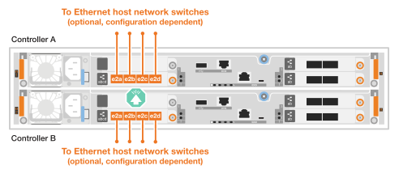
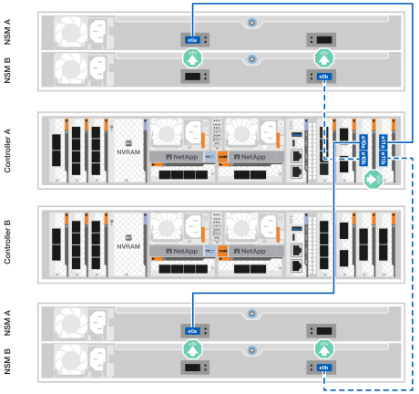

= ASA R2ストレージシステムのハードウェアのケーブル接続
:allow-uri-read: 
:icons: font
:imagesdir: ../media/

[role="lead"]
ASA R2ストレージシステムのラックハードウェアを設置したら、コントローラにネットワークケーブルを接続し、コントローラとストレージシェルフの間をケーブルで接続します。

.開始する前に
ストレージシステムをネットワークスイッチに接続する方法については、ネットワーク管理者にお問い合わせください。

.タスクの内容
* ここでは、一般的な設定について説明します。具体的なケーブル接続は、ご使用のストレージシステム用に注文したコンポーネントによって異なります。設定およびスロットプライオリティの詳細については、を参照してください link:https://hwu.netapp.com["NetApp Hardware Universe"^]。
* 一般的な構成については、クラスタ/ HAおよびホストネットワークのケーブル接続手順を参照してください。
+
ケーブル接続手順に構成が見つからない場合は、 link:https://hwu.netapp.com["NetApp Hardware Universe"^]ストレージ システムを適切にケーブル接続するための包括的な構成とスロットの優先順位に関する情報。

* ASA A1K、ASA A70、または ASA A90 ストレージ システムを使用している場合、I/O スロットの番号は 1 ～ 11 になります。
+
image::../media/drw_a1K_back_slots_labeled_ieops-2162.svg[ASA A1K、ASA A70、および ASA A90 コントローラのスロット番号]

* ケーブル配線図には、ポートにコネクタを挿入する際のケーブルコネクタプルタブの正しい方向（上または下）を示す矢印アイコンがあります。
+
コネクタを挿入すると、カチッという音がしてコネクタが所定の位置に収まるはずです。カチッと音がしない場合は、コネクタを取り外し、裏返してもう一度試してください。

+
image:../media/drw_cable_pull_tab_direction_ieops-1699.svg["ケーブルプルタブの方向"]

* 光スイッチにケーブル接続する場合は、光トランシーバをコントローラポートに挿入してから、スイッチポートにケーブル接続します。

== 手順1：クラスタ/ HAをケーブル接続する

コントローラをONTAPクラスタにケーブル接続します。この手順は、ストレージシステムのモデルおよびI/Oモジュールの構成によって異なります。

NOTE: クラスタインターコネクトトラフィックとHAトラフィックは、同じ物理ポートを共有します。

[role="tabbed-block"]
====
.A1K
--
ONTAPクラスタ接続を作成スイッチレスクラスタの場合は、コントローラを相互に接続します。スイッチクラスタの場合は、コントローラをクラスタネットワークスイッチに接続します。

.スイッチレスクラスタのケーブル接続
[%collapsible]
=====
クラスタ/ HAインターコネクトケーブルを使用して、ポートe1aとe1a、ポートe7aとe7aを接続します。

.手順
. コントローラAのポートe1aをコントローラBのポートe1aに接続します。
. コントローラAのポートe7aをコントローラBのポートe1aに接続します。
+
*クラスタ/ HAインターコネクトケーブル*

+
image::../media/oie_cable_25Gb_Ethernet_SFP28_IEOPS-1069.svg[クラスタHAケーブル]

+
image::../media/drw_a1k_tnsc_cluster_cabling_ieops-1648.svg[2ノードスイッチレスクラスタのケーブル配線図]

=====
.スイッチクラスタのケーブル接続
[%collapsible]
=====
100GbEケーブルを使用して、ポートe1aとe1a、ポートe7aとe7aを接続します。

NOTE: スイッチクラスタ構成は9.16.1以降でサポートされます。

.手順
. コントローラAのポートe1aとコントローラBのポートe1aをクラスタネットワークスイッチAに接続します。
. コントローラAのポートe7aとコントローラBのポートe7aをクラスタネットワークスイッチBに接続します。
+
* 100GbEケーブル*

+
image::../media/oie_cable100_gbe_qsfp28.png[100Gbケーブル]

+
image::../media/drw_a1k_switched_cluster_cabling_ieops-1652.svg[クラスタネットワークへのクラスタ接続のケーブル接続]

=====
--
.A70およびA90
--
ONTAPクラスタ接続を作成スイッチレスクラスタの場合は、コントローラを相互に接続します。スイッチクラスタの場合は、コントローラをクラスタネットワークスイッチに接続します。

.スイッチレスクラスタのケーブル接続
[%collapsible]
=====
クラスタ/ HAインターコネクトケーブルを使用して、ポートe1aとe1a、ポートe7aとe7aを接続します。

.手順
. コントローラAのポートe1aをコントローラBのポートe1aに接続します。
. コントローラAのポートe7aをコントローラBのポートe1aに接続します。
+
*クラスタ/ HAインターコネクトケーブル*

+
image::../media/oie_cable_25Gb_Ethernet_SFP28_IEOPS-1069.svg[クラスタHAケーブル]

+
image::../media/drw_70-90_tnsc_cluster_cabling_ieops-1653.svg[2ノードスイッチレスクラスタのケーブル配線図]

=====
.スイッチクラスタのケーブル接続
[%collapsible]
=====
100GbEケーブルを使用して、ポートe1aとe1a、ポートe7aとe7aを接続します。

NOTE: スイッチクラスタ構成は9.16.1以降でサポートされます。

.手順
. コントローラAのポートe1aとコントローラBのポートe1aをクラスタネットワークスイッチAに接続します。
. コントローラAのポートe7aとコントローラBのポートe7aをクラスタネットワークスイッチBに接続します。
+
* 100GbEケーブル*

+
image::../media/oie_cable100_gbe_qsfp28.png[100Gbケーブル]

+
image::../media/drw_70-90_switched_cluster_cabling_ieops-1657.svg[クラスタネットワークへのクラスタ接続のケーブル接続]

=====
--
.A20 、 A30 、および A50
--
ONTAPクラスタ接続を作成スイッチレスクラスタの場合は、コントローラを相互に接続します。スイッチクラスタの場合は、コントローラをクラスタネットワークスイッチに接続します。

[NOTE]
====
クラスタ/HA のケーブル接続例は、一般的な構成を示しています。

ここにあなたの設定が表示されない場合は、 link:https://hwu.netapp.com["NetApp Hardware Universe"^] ストレージ システムをケーブル接続するための包括的な構成とスロットの優先順位に関する情報。

====
*スイッチレスクラスタのケーブル配線*

コントローラを相互に接続して、ONTAPクラスタ接続を作成します。

.2ポートの40 / 100GbE I/Oモジュールを2つ搭載したASA A30およびASA A50
[%collapsible]
=====
.手順
. クラスタ/ HAインターコネクト接続を接続します。
+

NOTE: クラスタインターコネクトトラフィックとHAトラフィックは、同じ物理ポート（スロット2と4のI/Oモジュール）を共有します。ポートは40 / 100GbEです。

+
.. コントローラAのポートe2aをコントローラBのポートe2aに接続します。
.. コントローラAのポートe4aをコントローラBのポートe4aに接続します。
+

NOTE: I/Oモジュールのポートe2bおよびe4bは未使用で、ホストのネットワーク接続に使用できます。

+
* 100GbEクラスタ/ HAインターコネクトケーブル*

+
image::../media/oie_cable100_gbe_qsfp28.png[クラスタHA 100GbEケーブル]

+
image::../media/drw_isi_a30-50_switchless_2p_100gbe_2card_cabling_ieops-2011.svg[2つの100GbE IOモジュールを使用したA30およびA50スイッチレスクラスタのケーブル接続図]

=====
.ASA A30およびASA A50（2ポート40 / 100GbE I/Oモジュール×1）
[%collapsible]
=====
.手順
. クラスタ/ HAインターコネクト接続を接続します。
+

NOTE: クラスタインターコネクトトラフィックとHAトラフィックは、同じ物理ポートを共有します（スロット4のI/Oモジュール上）。ポートは40 / 100GbEです。

+
.. コントローラAのポートe4aをコントローラBのポートe4aに接続します。
.. コントローラAのポートe4bをコントローラBのポートe4bに接続します。
+
* 100GbEクラスタ/ HAインターコネクトケーブル*

+
image::../media/oie_cable100_gbe_qsfp28.png[クラスタHA 100GbEケーブル]

+
image::../media/drw_isi_a30-50_switchless_2p_100gbe_1card_cabling_ieops-1925.svg[1つの100GbE IOモジュールを使用したA30およびA50スイッチレスクラスタのケーブル配線図]

=====
.ASA A20：2ポート10 / 25GbE I/Oモジュール×1
[%collapsible]
=====
.手順
. クラスタ/ HAインターコネクト接続を接続します。
+

NOTE: クラスタインターコネクトトラフィックとHAトラフィックは、同じ物理ポートを共有します（スロット4のI/Oモジュール上）。ポートは10 / 25GbEです。

+
.. コントローラAのポートe4aをコントローラBのポートe4aに接続します。
.. コントローラAのポートe4bをコントローラBのポートe4bに接続します。
+
* 25GbEクラスタ/ HAインターコネクトケーブル*

+
image:../media/oie_cable_sfp_gbe_copper.png["GbE SFP銅線コネクタ、幅= 100px"]

+
image::../media/drw_isi_a20_switchless_2p_25gbe_cabling_ieops-2018.svg[1つの25GbE IOモジュールを使用したA20スイッチレスクラスタのケーブル配線図]

=====
*スイッチクラスタのケーブル配線*

コントローラをクラスタネットワークスイッチに接続して、ONTAPクラスタ接続を作成します。

.2ポートの40 / 100GbE I/Oモジュールを2つ搭載したASA A30またはASA A50
[%collapsible]
=====
.手順
. クラスタ/ HAインターコネクト接続をケーブル接続します。
+

NOTE: クラスタインターコネクトトラフィックとHAトラフィックは、同じ物理ポート（スロット2と4のI/Oモジュール）を共有します。ポートは40 / 100GbEです。

+
.. コントローラー A のポート e4a をクラスター ネットワーク スイッチ A に接続します。
.. コントローラー A のポート e2a をクラスター ネットワーク スイッチ B に接続します。
.. コントローラー B のポート e4a をクラスター ネットワーク スイッチ A に接続します。
.. コントローラー B のポート e2a をクラスター ネットワーク スイッチ B に接続します。
+

NOTE: I/Oモジュールのポートe2bおよびe4bは未使用で、ホストのネットワーク接続に使用できます。

+
* 40 / 100GbEクラスタ/ HAインターコネクトケーブル*

+
image::../media/oie_cable100_gbe_qsfp28.png[クラスタHA 40 / 100GbEケーブル]

+
image::../media/drw_isi_a30-50_switched_2p_100gbe_2card_cabling_ieops-2013.svg[2つの100GbE IOモジュールを使用したA30およびA50スイッチクラスタのケーブル配線図]

=====
.ASA A30またはASA A50（2ポート40 / 100GbE I/Oモジュール×1）
[%collapsible]
=====
.手順
. コントローラをクラスタネットワークスイッチにケーブル接続します。
+

NOTE: クラスタインターコネクトトラフィックとHAトラフィックは、同じ物理ポートを共有します（スロット4のI/Oモジュール上）。ポートは40 / 100GbEです。

+
.. コントローラー A のポート e4a をクラスター ネットワーク スイッチ A に接続します。
.. コントローラ A のポート e4b をクラスター ネットワーク スイッチ B に接続します。
.. コントローラー B のポート e4a をクラスター ネットワーク スイッチ A に接続します。
.. コントローラー B のポート e4b をクラスター ネットワーク スイッチ B に接続します。
+
* 40 / 100GbEクラスタ/ HAインターコネクトケーブル*

+
image::../media/oie_cable100_gbe_qsfp28.png[クラスタHA 40 / 100GbEケーブル]

+
image::../media/drw_isi_a30-50_2p_100gbe_1card_switched_cabling_ieops-1926.svg[クラスタネットワークへのクラスタ接続のケーブル接続]

=====
.ASA A20：2ポート10 / 25GbE I/Oモジュール×1
[%collapsible]
=====
. コントローラをクラスタネットワークスイッチにケーブル接続します。
+

NOTE: クラスタインターコネクトトラフィックとHAトラフィックは、同じ物理ポートを共有します（スロット4のI/Oモジュール上）。ポートは10 / 25GbEです。

+
.. コントローラー A のポート e4a をクラスター ネットワーク スイッチ A に接続します。
.. コントローラ A のポート e4b をクラスター ネットワーク スイッチ B に接続します。
.. コントローラー B のポート e4a をクラスター ネットワーク スイッチ A に接続します。
.. コントローラー B のポート e4b をクラスター ネットワーク スイッチ B に接続します。
+
* 10/25GbEクラスタ/ HAインターコネクトケーブル*

+
image::../media/oie_cable_sfp_gbe_copper.png[GbE SFP銅線コネクタ]

+
image::../media/drw_isi_a20_switched_2p_25gbe_cabling_ieops-2019.svg[1つの25GbE IOモジュールを使用したA20スイッチクラスタのケーブル配線図]

=====
--
.C30
--
ONTAPクラスタ接続を作成スイッチレスクラスタの場合は、コントローラを相互に接続します。スイッチクラスタの場合は、コントローラをクラスタネットワークスイッチに接続します。

[NOTE]
====
クラスタ/HA のケーブル接続例は、一般的な構成を示しています。

ここにあなたの設定が表示されない場合は、 link:https://hwu.netapp.com["NetApp Hardware Universe"^] ストレージ システムをケーブル接続するための包括的な構成とスロットの優先順位に関する情報。

====
*スイッチレスクラスタのケーブル配線*

コントローラを相互に接続して、ONTAPクラスタ接続を作成します。

.2 つの 2 ポート 40/100 GbE I/O モジュールを備えた ASA C30
[%collapsible]
=====
.手順
. クラスタ/ HAインターコネクト接続をケーブル接続します。
+

NOTE: クラスタインターコネクトトラフィックとHAトラフィックは、同じ物理ポート（スロット2と4のI/Oモジュール）を共有します。ポートは40 / 100GbEです。

+
.. コントローラAのポートe2aをコントローラBのポートe2aに接続します。
.. コントローラAのポートe4aをコントローラBのポートe4aに接続します。
+

NOTE: I/Oモジュールのポートe2bおよびe4bは未使用で、ホストのネットワーク接続に使用できます。

+
* 100GbEクラスタ/ HAインターコネクトケーブル*

+
image::../media/oie_cable100_gbe_qsfp28.png[クラスタHA 100GbEケーブル]

+
image::../media/drw_isi_a30-50_switchless_2p_100gbe_2card_cabling_ieops-2011.svg[2つの100GbE IOモジュールを使用したA30およびA50スイッチレスクラスタのケーブル接続図]

=====
.2 ポート 40/100 GbE I/O モジュールを 1 つ備えた ASA C30
[%collapsible]
=====
.手順
. クラスタ/ HAインターコネクト接続をケーブル接続します。
+

NOTE: クラスタインターコネクトトラフィックとHAトラフィックは、同じ物理ポートを共有します（スロット4のI/Oモジュール上）。ポートは40 / 100GbEです。

+
.. コントローラAのポートe4aをコントローラBのポートe4aに接続します。
.. コントローラAのポートe4bをコントローラBのポートe4bに接続します。
+
* 100GbEクラスタ/ HAインターコネクトケーブル*

+
image::../media/oie_cable100_gbe_qsfp28.png[クラスタHA 100GbEケーブル]

+
image::../media/drw_isi_a30-50_switchless_2p_100gbe_1card_cabling_ieops-1925.svg[100GBE IOモジュール1つを使用したC30スイッチレスクラスタ配線図]

=====
*スイッチクラスタのケーブル配線*

コントローラをクラスタネットワークスイッチに接続して、ONTAPクラスタ接続を作成します。

.2 つの 2 ポート 40/100 GbE I/O モジュールを備えた ASA C30
[%collapsible]
=====
.手順
. クラスタ/ HAインターコネクト接続をケーブル接続します。
+

NOTE: クラスタインターコネクトトラフィックとHAトラフィックは、同じ物理ポート（スロット2と4のI/Oモジュール）を共有します。ポートは40 / 100GbEです。

+
.. コントローラー A のポート e4a をクラスター ネットワーク スイッチ A に接続します。
.. コントローラー A のポート e2a をクラスター ネットワーク スイッチ B に接続します。
.. コントローラー B のポート e4a をクラスター ネットワーク スイッチ A に接続します。
.. コントローラー B のポート e2a をクラスター ネットワーク スイッチ B に接続します。
+

NOTE: I/Oモジュールのポートe2bおよびe4bは未使用で、ホストのネットワーク接続に使用できます。

+
* 40 / 100GbEクラスタ/ HAインターコネクトケーブル*

+
image::../media/oie_cable100_gbe_qsfp28.png[クラスタHA 40 / 100GbEケーブル]

+
image::../media/drw_isi_a30-50_switched_2p_100gbe_2card_cabling_ieops-2013.svg[2つの100GBE IOモジュールを使用したC30スイッチドクラスタ配線図]

=====
.2 ポート 40/100 GbE I/O モジュールを 1 つ備えた ASA C30
[%collapsible]
=====
.手順
. コントローラーをクラスター ネットワーク スイッチに接続します。
+

NOTE: クラスタインターコネクトトラフィックとHAトラフィックは、同じ物理ポートを共有します（スロット4のI/Oモジュール上）。ポートは40 / 100GbEです。

+
.. コントローラー A のポート e4a をクラスター ネットワーク スイッチ A に接続します。
.. コントローラ A のポート e4b をクラスター ネットワーク スイッチ B に接続します。
.. コントローラー B のポート e4a をクラスター ネットワーク スイッチ A に接続します。
.. コントローラー B のポート e4b をクラスター ネットワーク スイッチ B に接続します。
+
* 40 / 100GbEクラスタ/ HAインターコネクトケーブル*

+
image::../media/oie_cable100_gbe_qsfp28.png[クラスタHA 40 / 100GbEケーブル]

+
image::../media/drw_isi_a30-50_2p_100gbe_1card_switched_cabling_ieops-1926.svg[クラスタネットワークへのクラスタ接続のケーブル接続]

=====
--
====

== 手順2：ホストネットワーク接続をケーブル接続する

コントローラをホストネットワークに接続します。

この手順は、ストレージシステムのモデルおよびI/Oモジュールの構成によって異なります。

[role="tabbed-block"]
====
.A1K
--
イーサネットモジュールポートをホストネットワークに接続します。

次に、一般的なホストネットワークのケーブル接続例を示します。ご使用のシステム構成については、を参照してください link:https://hwu.netapp.com["NetApp Hardware Universe"^] 。

.手順
. ポートe9aおよびe9bをイーサネットデータネットワークスイッチに接続します。
+

NOTE: クラスタトラフィックおよびHAトラフィックのシステムパフォーマンスを最大限に高めるために、ホストネットワーク接続にポートe1bおよびe7bを使用しないでください。パフォーマンスを最大化するには、別のホストカードを使用します。

+
* 100GbEケーブル*

+
image::../media/oie_cable_sfp_gbe_copper.svg[100Gbイーサネットケーブル]

+
image::../media/drw_a1k_network_cabling1_ieops-1649.svg[100Gbイーサネットネットワークへのケーブル接続]

. 10 / 25GbEホストネットワークスイッチを接続します。
+
* 10/25GbEホスト*

+
image::../media/oie_cable_sfp_gbe_copper.svg[10/25Gbイーサネットケーブル]

+
image::../media/drw_a1k_network_cabling2_ieops-1650.svg[10 / 25Gbイーサネットネットワークへのケーブル接続]

--
.A70およびA90
--
イーサネットモジュールポートをホストネットワークに接続します。

次に、一般的なホストネットワークのケーブル接続例を示します。ご使用のシステム構成については、を参照してください link:https://hwu.netapp.com["NetApp Hardware Universe"^] 。

.手順
. ポートe9aおよびe9bをイーサネットデータネットワークスイッチに接続します。
+

NOTE: クラスタトラフィックおよびHAトラフィックのシステムパフォーマンスを最大限に高めるために、ホストネットワーク接続にポートe1bおよびe7bを使用しないでください。パフォーマンスを最大化するには、別のホストカードを使用します。

+
* 100GbEケーブル*

+
image::../media/oie_cable_sfp_gbe_copper.svg[100Gbイーサネットケーブル]

+
image::../media/drw_70-90_network_cabling1_ieops-1654.svg[100Gbイーサネットネットワークへのケーブル接続]

. 10 / 25GbEホストネットワークスイッチを接続します。
+
* 4ポート、10/25GbEホスト*

+
image::../media/oie_cable_sfp_gbe_copper.svg[10/25Gbケーブル]

+
image::../media/drw_70-90_network_cabling2_ieops-1655.svg[100Gbイーサネットネットワークへのケーブル接続]

--
.A20 、 A30 、および A50
--
イーサネットモジュールポートまたはファイバチャネル（FC）モジュールポートをホストネットワークに接続します。

[NOTE]
====
ホスト ネットワークのケーブル接続の例は、一般的な構成を示しています。

ここにあなたの設定が表示されない場合は、 link:https://hwu.netapp.com["NetApp Hardware Universe"^] ストレージ システムをケーブル接続するための包括的な構成とスロットの優先順位に関する情報。

====
*イーサネットホストケーブル接続*

.2ポートの40 / 100GbE I/Oモジュールを2つ搭載したASA A30およびASA A50
[%collapsible]
=====
各コントローラで、ポートe2bとe4bをイーサネットホストネットワークスイッチに接続します。

NOTE: スロット2および4のI/Oモジュールのポートは40 / 100GbE（ホスト接続は40 / 100GbE）です。

* 40/100GbEケーブル*

image::../media/oie_cable_sfp_gbe_copper.png[40 / 100Gbケーブル]

image::../media/drw_isi_a30-50_host_2p_40-100gbe_2card_cabling_ieops-2014.svg[40 / 100GbEイーサネットホストネットワークスイッチへのケーブル接続]

=====
.ASA A20、A30、および A50（4 ポート 10/25 GbE I/O モジュール 1 台搭載）
[%collapsible]
=====
各コントローラで、ポートe2a、e2b、e2c、e2dをイーサネットホストネットワークスイッチに接続します。

* 10/25GbEケーブル*

image:../media/oie_cable_sfp_gbe_copper.png["GbE SFP銅線コネクタ、幅= 100px"]

=====
* FCホストケーブル接続*

.ASA A20、A30、および A50（4 ポート 64 Gb/s FC I/O モジュール 1 個搭載）
[%collapsible]
=====
各コントローラで、ポート1a、1b、1c、1dをFCホストネットワークスイッチに接続します。

* 64 Gb/秒FCケーブル*

image:../media/oie_cable_sfp_gbe_copper.png["64Gb FCケーブル、幅= 100px"]

image::../media/drw_isi_a30-50_4p_64gb_fc_1card_cabling_ieops-1924.svg[64Gb FCホストネットワークスイッチへのケーブル接続]

=====
--
.C30
--
イーサネットモジュールポートまたはファイバチャネル（FC）モジュールポートをホストネットワークに接続します。

[NOTE]
====
ホスト ネットワークのケーブル接続の例は、一般的な構成を示しています。

ここにあなたの設定が表示されない場合は、 link:https://hwu.netapp.com["NetApp Hardware Universe"^] ストレージ システムをケーブル接続するための包括的な構成とスロットの優先順位に関する情報。

====
*イーサネットホストケーブル接続*

.2 つの 2 ポート 40/100 GbE I/O モジュールを備えた ASA C30
[%collapsible]
=====
.手順
. 各コントローラで、ポートe2bおよびe4bをイーサネットホストネットワークスイッチにケーブル接続します。
+

NOTE: スロット2および4のI/Oモジュールのポートは40 / 100GbE（ホスト接続は40 / 100GbE）です。

+
* 40/100GbEケーブル*

+
image::../media/oie_cable_sfp_gbe_copper.png[40 / 100Gbケーブル]

+
image::../media/drw_isi_a30-50_host_2p_40-100gbe_2card_cabling_ieops-2014.svg[40 / 100GbEイーサネットホストネットワークスイッチへのケーブル接続]

=====
.ASA C30：4ポート10 / 25GbE I/Oモジュール×1
[%collapsible]
=====
.手順
. 各コントローラで、ポートe2a、e2b、e2c、e2dをイーサネットホストネットワークスイッチにケーブル接続します。
+
* 10/25GbEケーブル*

+
image:../media/oie_cable_sfp_gbe_copper.png["GbE SFP銅線コネクタ、幅= 100px"]

+

=====
.4ポート64 Gb/s FC I/Oモジュール1個を搭載したASA C30
[%collapsible]
=====
.手順
. 各コントローラで、ポート1a、1b、1c、および1dをFCホストネットワークスイッチにケーブル接続します。
+
* 64 Gb/秒FCケーブル*

+
image:../media/oie_cable_sfp_gbe_copper.png["64Gb FCケーブル、幅= 100px"]

+
image::../media/drw_isi_a30-50_4p_64gb_fc_1card_cabling_ieops-1924.svg[64Gb FCホストネットワークスイッチへのケーブル接続]

=====
--
====

== 手順3：管理ネットワークをケーブル接続する

コントローラを管理ネットワークに接続します。

ストレージシステムを管理ネットワークスイッチに接続する方法については、ネットワーク管理者にお問い合わせください。

[role="tabbed-block"]
====
.A1K
--
1000BASE-T RJ-45ケーブルを使用して、各コントローラの管理（レンチ）ポートを管理ネットワークスイッチに接続します。

image::../media/oie_cable_rj45.svg[RJ-45ケーブル]

* 1000BASE-T RJ-45ケーブル*

image::../media/drw_a1k_management_connection_ieops-1651.svg[管理ネットワークへの接続]

IMPORTANT: まだ電源コードを接続しないでください。

--
.A70およびA90
--
1000BASE-T RJ-45ケーブルを使用して、各コントローラの管理（レンチ）ポートを管理ネットワークスイッチに接続します。

image::../media/oie_cable_rj45.svg[RJ45ケーブル]

* 1000BASE-T RJ-45ケーブル*

image::../media/drw_70-90_management_connection_ieops-1656.svg[管理ネットワークへの接続]

IMPORTANT: まだ電源コードを接続しないでください。

--
.A20 、 A30 、および A50
--
各コントローラの管理（レンチマーク）ポートを管理ネットワークスイッチに接続します。

* 1000BASE-T RJ-45ケーブル*

image::../media/oie_cable_rj45.png[RJ-45ケーブル]

image::../media/drw_isi_g_wrench_cabling_ieops-1928.svg[管理ネットワークへの接続]

IMPORTANT: まだ電源コードを接続しないでください。

--
.C30
--
各コントローラの管理（レンチマーク）ポートを管理ネットワークスイッチに接続します。

* 1000BASE-T RJ-45ケーブル*

image::../media/oie_cable_rj45.png[RJ-45ケーブル]

image::../media/drw_isi_g_wrench_cabling_ieops-1928.svg[管理ネットワークへの接続]

IMPORTANT: まだ電源コードを接続しないでください。

--
====

== 手順4：シェルフをケーブル接続する

次のケーブル接続手順では、コントローラをストレージシェルフに接続する方法を示します。

ストレージシステムでサポートされるシェルフの最大数、および光ファイバやスイッチ接続などのすべてのケーブル接続オプションについては、を参照してくださいlink:https://hwu.netapp.com["NetApp Hardware Universe"^]。

[role="tabbed-block"]
====
.A1K
--
AFF A1Kストレージシステムは、NSM100またはNSM100Bモジュールを搭載したNS224シェルフをサポートします。モジュール間の主な違いは次のとおりです。

* NSM100 シェルフ モジュールは、組み込みポート e0a および e0b を使用します。
* NSM100B シェルフ モジュールは、スロット 1 のポート e1a と e1b を使用します。

次の配線例は、シェルフ モジュール ポートを参照する場合の NS224 シェルフ内の NSM100 モジュールを示しています。

次のいずれかのケーブル接続オプションを、ご使用の環境に合わせて選択します。

.オプション1：NS224ストレージシェルフ1台
[%collapsible]
=====
各コントローラをNS224シェルフのNSMモジュールに接続します。図は、各コントローラからのケーブル接続を示しています。コントローラAのケーブル接続は青、コントローラBのケーブル接続は黄色です。

.手順
. コントローラAで、次のポートを接続します。
+
.. ポートe11aをNSM Aのポートe0aに接続します。
.. ポートe11bをポートNSM Bのポートe0bに接続します。
+
image:../media/drw_a1k_1shelf_cabling_a_ieops-1703.svg["コントローラAのe11aおよびe11bを1台のNS224シェルフに移行"]

. コントローラBで、次のポートを接続します。
+
.. ポートe11aをNSM Bのポートe0aに接続します。
.. ポートe11bをNSM Aのポートe0bに接続します。
+
image:../media/drw_a1k_1shelf_cabling_b_ieops-1704.svg["コントローラBのポートe11aとe11bを単一のNS224シェルフに接続します。"]

=====
.オプション2：NS224ストレージシェルフ×2
[%collapsible]
=====
各コントローラを両方のNS224シェルフのNSMモジュールに接続します。図は、各コントローラからのケーブル接続を示しています。コントローラAのケーブル接続は青、コントローラBのケーブル接続は黄色です。

.手順
. コントローラAで、次のポートを接続します。
+
.. ポートe11aをシェルフ1のNSM Aのポートe0aに接続します。
.. ポートe11bをシェルフ2のNSM Bのポートe0bに接続します。
.. ポートe10aをシェルフ2のNSM Aのポートe0aに接続します。
.. ポートe10bをシェルフ1のNSM Aのポートe0bに接続します。
+

. コントローラBで、次のポートを接続します。
+
.. ポートe11aをシェルフ1のNSM Bのポートe0aに接続します。
.. ポートe11bをシェルフ2のNSM Aのポートe0bに接続します。
.. ポートe10aをシェルフ2のNSM Bのポートe0aに接続します。
.. ポートe10bをシェルフ1のNSM Aのポートe0bに接続します。
+
image:../media/drw_a1k_2shelf_cabling_b_ieops-1706.svg["コントローラBのコントローラ/シェルフ間の接続"]

=====
--
.A70およびA90
--
AFF A70および90ストレージシステムは、NSM100またはNSM100Bモジュールを搭載したNS224シェルフをサポートします。モジュール間の主な違いは次のとおりです。

* NSM100 シェルフ モジュールは、組み込みポート e0a および e0b を使用します。
* NSM100B シェルフ モジュールは、スロット 1 のポート e1a と e1b を使用します。

次の配線例は、シェルフ モジュール ポートを参照する場合の NS224 シェルフ内の NSM100 モジュールを示しています。

次のいずれかのケーブル接続オプションを、ご使用の環境に合わせて選択します。

.オプション1：NS224ストレージシェルフ1台
[%collapsible]
=====
各コントローラをNS224シェルフのNSMモジュールに接続します。図は、各コントローラからのケーブル接続を示しています。コントローラAのケーブル接続は青、コントローラBのケーブル接続は黄色です。

* 100GbE QSFP28銅線ケーブル*

image::../media/oie_cable100_gbe_qsfp28.svg[100GbE QSFP28銅線ケーブル]

.手順
. コントローラAのポートe11aをNSM Aのポートe0aに接続します。
. コントローラAのポートe11bをポートNSM Bのポートe0bに接続します。
+
image:../media/drw_a70-90_1shelf_cabling_a_ieops-1731.svg["コントローラAのe11aおよびe11bを1台のNS224シェルフに移行"]

. コントローラBのポートe11aをNSM Bのポートe0aに接続します。
. コントローラBのポートe11bをNSM Aのポートe0bに接続します。
+
image:../media/drw_a70-90_1shelf_cabling_b_ieops-1732.svg["コントローラB e11aおよびe11bを1台のNS224シェルフに接続"]

=====
.オプション2：NS224ストレージシェルフ×2
[%collapsible]
=====
各コントローラを両方のNS224シェルフのNSMモジュールに接続します。図は、各コントローラからのケーブル接続を示しています。コントローラAのケーブル接続は青、コントローラBのケーブル接続は黄色です。

* 100GbE QSFP28銅線ケーブル*

image::../media/oie_cable100_gbe_qsfp28.svg[100GbE QSFP28銅線ケーブル]

.手順
. コントローラAで、次のポートを接続します。
+
.. ポートe11aをシェルフ1、NSM Aのポートe0aに接続します。
.. ポートe11bをシェルフ2、NSM Bのポートe0bに接続します。
.. ポートe8aをシェルフ2、NSM Aのポートe0aに接続します。
.. ポートe8bをシェルフ1、NSM Bのポートe0bに接続します。
+
image:../media/drw_a70-90_2shelf_cabling_a_ieops-1733.svg["コントロオラAノコントロオラ/シエルフカンノセツソク"]

. コントローラBで、次のポートを接続します。
+
.. ポートe11aをシェルフ1、NSM Bのポートe0aに接続します。
.. ポートe11bをシェルフ2、NSM Aのポートe0bに接続します。
.. ポートe8aをシェルフ2、NSM Bのポートe0aに接続します。
.. ポートe8bをシェルフ1、NSM Aのポートe0bに接続します。
+
image:../media/drw_a70-90_2shelf_cabling_b_ieops-1734.svg["コントローラBのコントローラ/シェルフ間の接続"]

=====
--
.A20 、 A30 、および A50
--
NS224シェルフの配線手順では、NSM100モジュールではなくNSM100Bモジュールが示されています。使用するNSMモジュールの種類に関わらず、配線は同じで、ポート名のみが異なります。

* NSM100B モジュールは、スロット 1 の I/O モジュール上のポート e1a と e1b を使用します。
* NSM100 モジュールは、内蔵 (オンボード) ポート e0a および e0b を使用します。

ストレージ システムに付属のストレージ ケーブルを使用して、各コントローラを NS224 シェルフ上の各 NSM モジュールに接続します。ストレージ ケーブルの種類は次のとおりです。

* 100GbE QSFP28銅線ケーブル*

image::../media/oie_cable100_gbe_qsfp28.png[100GbE QSFP28銅線ケーブル]

図は、コントローラAのケーブル配線を青で示し、コントローラBのケーブル配線を黄色で示しています。

.手順
. コントローラAをシェルフに接続します。
+
.. コントローラAのポートe3aをNSM Aのポートe1aに接続します。
.. コントローラAのポートe3bをNSM Bのポートe1bに接続します。
+
image:../media/drw_isi_g_1_ns224_controller_a_cabling_ieops-1945.svg["コントローラAのポートe3aおよびe3bを1台のNS224シェルフに接続"]

. コントローラBをシェルフに接続します。
+
.. コントローラBのポートe3aをNSM Bのポートe1aに接続します。
.. コントローラBのポートe3bをNSM Aのポートe1bに接続します。
+
image:../media/drw_isi_g_1_ns224_controller_b_cabling_ieops-1946.svg["コントローラBのポートe3aおよびe3bを1台のNS224シェルフに接続"]

--
.C30
--
NS224シェルフの配線手順では、NSM100モジュールではなくNSM100Bモジュールが示されています。使用するNSMモジュールの種類に関わらず、配線は同じで、ポート名のみが異なります。

* NSM100B モジュールは、スロット 1 の I/O モジュール上のポート e1a と e1b を使用します。
* NSM100 モジュールは、内蔵 (オンボード) ポート e0a および e0b を使用します。

ストレージ システムに付属のストレージ ケーブルを使用して、各コントローラを NS224 シェルフ上の各 NSM モジュールに接続します。ストレージ ケーブルの種類は次のとおりです。

* 100GbE QSFP28銅線ケーブル*

image::../media/oie_cable100_gbe_qsfp28.png[100GbE QSFP28銅線ケーブル]

図は、コントローラAのケーブル配線を青で示し、コントローラBのケーブル配線を黄色で示しています。

.手順
. コントローラAをシェルフに接続します。
+
.. コントローラAのポートe3aをNSM Aのポートe1aに接続します。
.. コントローラAのポートe3bをNSM Bのポートe1bに接続します。
+
image:../media/drw_isi_g_1_ns224_controller_a_cabling_ieops-1945.svg["コントローラAのポートe3aおよびe3bを1台のNS224シェルフに接続"]

. コントローラBをシェルフに接続します。
+
.. コントローラBのポートe3aをNSM Bのポートe1aに接続します。
.. コントローラBのポートe3bをNSM Aのポートe1bに接続します。
+
image:../media/drw_isi_g_1_ns224_controller_b_cabling_ieops-1946.svg["コントローラBのポートe3aおよびe3bを1台のNS224シェルフに接続"]

--
====
.次の手順
ストレージコントローラをネットワークに接続し、コントローラをストレージシェルフに接続したら、次の作業を行いlink:power-on-hardware.html["ASA R2ストレージシステムの電源をオンにします。"]ます。
