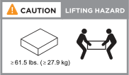

= ASA R2ストレージシステムのインストール要件
:allow-uri-read: 
:icons: font
:imagesdir: ../media/

[role="lead"]
ASA R2ストレージシステムとストレージシェルフに必要な機器と、持ち上げる際の注意事項を確認します。

== 設置に必要な機器

ASA R2ストレージシステムを設置するには、次の機器と工具が必要です。

* ストレージシステムを設定するためのWebブラウザへのアクセス
* 静電放電（ESD）ストラップ
* 懐中電灯
* USB /シリアル接続を備えたラップトップまたはコンソール
* ストレージシェルフIDを設定するためのペーパークリップまたはボールペン
* No.2プラスドライバ

== 吊り上げ時の注意事項

ASA R2ストレージシステムとストレージシェルフは重量があります。これらのアイテムを持ち上げたり移動したりするときは、注意してください。

=== ストレージシステムノオモミ

ASA R2ストレージシステムを移動または持ち上げるときは、必要な予防措置を講じてください。

[role="tabbed-block"]
====
.A1K
--
ASA A1Kストレージシステムの重量は最大28.5 kg（62.83ポンド）です。ストレージ・システムを持ち上げるには、2人で作業するか、油圧リフトを使用します。

image::../media/drw_a1k_weight_caution_ieops-1698.svg[ASA A1Kリフティング警告アイコン]

--
.A70およびA90
--
ASA A70またはASA A90ストレージシステムの重量は最大68.8 kg（151.68ポンド）です。ストレージ・システムを持ち上げるには、4人で作業するか、油圧リフトを使用します。

image::../media/drw_a70-90_weight_icon_ieops-1730.svg[ASA A90 ASA A70重量警告アイコン]

--
.A20 、 A30 、および A50
--
ASA A20、ASA A30、またはASA A50ストレージシステムの重量は最大27.9 kg（61.5ポンド）です。ストレージ・システムを持ち上げるには、2人で作業するか、油圧リフトを使用します。

--
.C30
--
ASA C30 ストレージ システムの重量は最大 61.5 ポンド (27.9 kg) になります。ストレージ・システムを持ち上げるには、2人で作業するか、油圧リフトを使用します。

--
====

=== 収納シェルフの重量

シェルフを移動または持ち上げるときは、必要な予防措置を講じてください。

[role="tabbed-block"]
====
.NS224シェルフ
--
NS224シェルフの重量は最大30.29kg（66.78ポンド）です。シェルフを持ち上げるには、2人で作業するか、油圧リフトを使用します。シェルフの重量がバランスを崩さないように、すべてのコンポーネント（前面と背面の両方）をシェルフに保管してください。

image::../media/drw_ns224_lifting_weight_ieops-1716.svg[NS224 NSM100の持ち上げに関する注意事項]

--
.NSM100Bモジュールを搭載したNS224シェルフ
--
NSM100Bモジュールを搭載したNS224シェルフの重量は最大25.8kg（56.8ポンド）です。シェルフを持ち上げるには、2人で作業するか、油圧リフトを使用します。シェルフの重量がバランスを崩さないように、すべてのコンポーネント（前面と背面の両方）をシェルフに保管してください。

image::../media/drw_ns224_nsm100b_lifting_weight_ieops-1832.svg[NSM100bを搭載したNS224の持ち上げに関する注意事項]

--
====
.関連情報
* https://library.netapp.com/ecm/ecm_download_file/ECMP12475945["安全に関する情報と規制に関する通知"^]

.次の手順
ハードウェア要件を確認したら、link:prepare-hardware.html["ASA R2ストレージシステムの設置の準備"]
