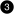

= ASA R2ストレージシステムの電源をオンにします。
:allow-uri-read: 
:icons: font
:imagesdir: ../media/

[role="lead"]
ASA R2ストレージシステムのラックハードウェアを設置し、コントローラとストレージシェルフのケーブルを接続したら、ストレージシェルフとコントローラの電源をオンにする必要があります。

== 手順1：シェルフの電源をオンにしてシェルフIDを割り当てる

NS224の各シェルフは一意のシェルフIDで識別されます。このIDにより、ストレージシステムの設定内でシェルフが区別されます。デフォルトでは、シェルフIDには「00」と「01」が割り当てられますが、ストレージシステム全体で一意になるように、これらのIDの調整が必要になる場合があります。

.タスクの内容
* 有効なシェルフIDは00~99です。
* シェルフIDを有効にするには、シェルフの電源を再投入する必要があります（両方の電源コードを取り外し、しばらく待ってから再度接続します）。

.手順
. シェルフの電源をオンにするには、まず電源コードをシェルフに接続し、電源コード固定クリップで所定の位置に固定してから、電源コードを別 々 の回路の電源に接続します。
+
シェルフを電源に接続すると、シェルフの電源が自動的にオンになり、ブートします。

. 前面プレートの後ろにあるシェルフIDボタンにアクセスするには、左側のエンドキャップを取り外します。
+
image::../media/drw_a900_oie_change_ns224_shelf_id_ieops-836.svg[NS224シェルフIDの変更]

+
[cols="20%,80%"]
|===

 a| 
image::../media/legend_icon_01.svg[番号1]
 a| 
シェルフのエンドキャップ

 a| 
image::../media/legend_icon_02.svg[[コールアウト番号2]
 a| 
シェルフ前面プレート

 a| 

 a| 
シェルフID番号

 a| 
image::../media/legend_icon_04.svg[[コールアウト番号4]
 a| 
シェルフIDボタン

|===
. シェルフIDの最初の番号を変更します。
+
.. ペーパークリップまたは先端の細いボールペンのまっすぐになった端を小さな穴に差し込み、シェルフIDボタンを押します。
.. デジタルディスプレイの1桁目の数字が点滅するまでシェルフIDボタンを押し続け、点滅したら放します。
+
点滅するまでに最大15秒かかることがあります。これにより、シェルフIDのプログラミングモードがアクティブになります。

+

NOTE: IDの点滅に15秒以上かかる場合は、シェルフIDボタンをもう一度押し続け、最後まで押します。

.. シェルフIDボタンを押して放し、目的の0~9の数字になるまで番号を進めます。
+
プレスおよびリリースの所要時間は1秒程度です。

+
1桁目の数字は点滅したままです。

. シェルフIDの2番目の番号を変更します。
+
.. デジタルディスプレイの2桁目の数字が点滅するまで、ボタンを押し続けます。
+
点滅するまでに最大3秒かかることがあります。

+
デジタルディスプレイの1桁目の数字の点滅が停止します。

.. シェルフIDボタンを押して放し、目的の0~9の数字になるまで番号を進めます。
+
2桁目の数字は点滅し続けます。

. 目的の番号をロックし、2桁目の番号の点滅が止まるまでシェルフIDボタンを押し続けてプログラミングモードを終了します。
+
点滅が停止するまでに最大3秒かかることがあります。

+
デジタルディスプレイの両方の数字が点滅し始め、約5秒後に黄色のLEDが点灯して、保留中のシェルフIDがまだ有効になっていないことを通知します。

. シェルフIDを有効にするために、シェルフの電源を10秒以上再投入します。
+
.. シェルフの両方の電源装置から電源コードを抜きます。
.. 10 秒待ちます。
.. 電源コードをシェルフの電源装置に再度接続して、電源を再投入します。
+
電源コードを接続するとすぐに電源装置の電源がオンになります。電源装置の2色LEDが緑色に点灯します。

. 左エンドキャップを取り付けます。

== 手順2：コントローラの電源をオンにする

ストレージシェルフの電源をオンにして一意のIDを割り当てたら、ストレージコントローラの電源をオンにします。

.手順
. ラップトップをシリアルコンソールポートに接続します。これにより、コントローラの電源がオンになっているときのブートシーケンスを監視できます。
+
.. ラップトップのシリアルコンソールポートを115、200ボー（N-8-1）に設定します。
+

NOTE: シリアルコンソールポートの設定手順については、ラップトップのオンラインヘルプを参照してください。

.. ストレージシステムに付属のコンソールケーブルを使用して、ラップトップにコンソールケーブルを接続し、コントローラのシリアルコンソールポートを接続します。
.. ラップトップを管理サブネット上のスイッチに接続します。
+
image::../media/drw_a1k_70-90_console_connection_ieops-1702.svg[コンソール接続]

.. 管理サブネット上のTCP/IPアドレスを使用して、ラップトップに割り当てます。

. 電源コードをコントローラの電源装置に接続し、さらに別の回路の電源に接続します。
+
image::../media/drw_affa1k_power_source_icon_ieops-1700.svg[一般的な電源接続図]

+
** ストレージシステムがブートを開始します。初回のブートには最大 8 分かかる場合があります。
** LEDが点滅し、ファンが起動します。これは、コントローラの電源がオンになっていることを示します。
** ファンは最初に起動するときに非常にうるさい場合があります。起動時のファンの異音は正常。

. 各電源装置の固定装置を使用して、電源ケーブルを固定します。

.次の手順
ASA R2ストレージシステムの電源を入れたら、link:initialize-ontap-cluster.html["ONTAP ASA R2クラスタのセットアップ"]
